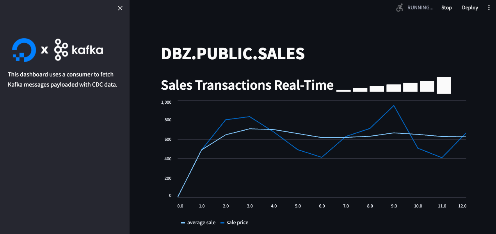

# Real-time Dashboard Apps
Real-time dashboard apps using Kafka + Streamlit.

**Kafka** is a distributed publish-subscribe messaging system that maintains feeds of messages in partitioned and replicated topics. There are three main components in the Kafka ecosystem: producers, topics (run by brokers) and consumers.

**Producers** produce messages to a topic. It is possible to attach a key to each message, in which case the producer guarantees that all messages with the same key will arrive to the same partition. 

**Topics** are logs that receive data from the producers and store them across their partitions. Producers always write new messages at the end of the log. 

**Consumers** read the messages of a set of partitions of a topic of their choice at their own pace. If the consumer is part of a consumer group, i.e. a group of consumers subscribed to the same topic, they can commit their offset. This can be important if a topic is needed to consume in parallel with different consumers.

# Python Setup
You'll need to create a working python envrionment and deploy the resources necessary for these examples

## Create Virtual Environment

```bash
conda create --name digitalocean python=3.11
conda activate digitalocean
pip install streamlit pandas psycopg2 kafka-python python-dotenv
```

# Terraform for DigitalOcean
Create a DigitalOcean [API Token](https://cloud.digitalocean.com/account/api/tokens/new)

Terraform will use your DigitalOcean Personal Access Token to communicate with the DigitalOcean API and manage resources in your account.

The api_token and name_postfix variables can be typed in at the execution time, or they can be set as OS environment variables, as follow:

```bash
  export TF_VAR_api_token='dop_v1_...'
  export TF_VAR_project='demo'
```

## Deployment

```bash
cd terraform-digitalocean
terraform init
terraform plan
terraform apply
```

Deployment will run (~5m) and create a Kafka instance, topics and a Postgres database.

## Limitations with Terraform Provider
* DigitalOcean provides both droplet and managed Kafka Solutions, documentation can be harder to follow (or non-existant).
* API Link from the UI generates a 404.
* The terraform registry only has the kafka cluster setup under [topic configuration](https://docs.digitalocean.com/reference/terraform/reference/resources/database_kafka_topic/)
* The terraform provider does not have outputs for certificates, and other service information, meaning a trip to the console or API to retrieve this information.
* The ecosystem is incomplete: Kafka is available, but not Connect, Schema Registry, ...forcing custom or local producers and consumers...
* There is no way to manage the service with the UI other than the creation of topics and users (cannot change settings like auto-create topics).

# Weather Example (Kafka)

## Producer Dashboard
The producer dashboard takes a location name as input, searches **Accuweather API** and receives current Weather data from it's APIs. Then, the **Kafka Producer** publises the Weather data to a Kafka topic.

## Consumer Dashboard
The consumer receives the published Weather data from the same Kafka topic and displayes in the consumer dashboard.

## How to use
Use the `terraform output kafka_uuid` to generate an API request for the service and save the certificates or download these from the DigitialOcean UI.

```bash
# CA File
curl -s -X GET "https://api.digitalocean.com/v2/databases/$(terraform output kafka_uuid)/ca" \
-H "Content-Type: application/json" \
-H "Authorization: Bearer $TF_VAR_api_token" | \
jq -r '.ca.certificate' |  base64 --decode > ../.certificates/ca-certificate.crt

# Service Certificate
curl -s -X GET "https://api.digitalocean.com/v2/databases/$(terraform output kafka_uuid)" \
-H "Content-Type: application/json" \
-H "Authorization: Bearer $TF_VAR_api_token" | \
jq -r '.database.users[].access_cert' > ../.certificates/user-access-certificate.crt

# Service Key
curl -s -X GET "https://api.digitalocean.com/v2/databases/$(terraform output kafka_uuid)" \
-H "Content-Type: application/json" \
-H "Authorization: Bearer $TF_VAR_api_token" | \
jq -r '.database.users[].access_key' > ../.certificates/user-access-key.key
```

Use the `terraform output postgres_uuid` to export a connection string for the PG service:

```bash
export DO_CONNECTION_URL=$(curl -s -X GET "https://api.digitalocean.com/v2/databases/$(terraform output postgres_uuid)" \
-H "Content-Type: application/json" \
-H "Authorization: Bearer $TF_VAR_api_token" | \
jq '.database.connection.uri')
```

Generate a free [Accuweather API Key](https://developer.accuweather.com/user/register)

In the *project root directory* (`cd ..`) create a `.env` file with following template:

```python
WEATHER_API_KEY = "Accuweather API KEY"
KAFKA_BROKER = "host:certificate_port"
WEATHER_TOPIC = "weather_data"
```

Run consumer dashboard in the background:
```python
streamlit run weather_consumer.py &
```


Run producer dashboard in the background:
```python
streamlit run weather_producer.py & 
```


You should be able to produce weather data for the Kafka instance, processed and displayed by the consumer.

# CDC Example (Postgres > Kafka)

DigitalOcean does not currently support Kafka Connect -- 

In the certificates directory, use the openssl tooling to create a key and truststore.
For simplicity, use the same password.

```bash
openssl pkcs12 -export            \
  -inkey user-access-key.key      \
  -in user-access-certificate.crt \
  -out client.keystore.p12        \
  -name service_key

keytool -import                   \
  -file ca-certificate.crt        \
  -alias CA                       \
  -keystore client.truststore.jks
```

The following binaries are needed to setup a Apache Kafka Connect cluster locally:

[Apache Kafka](https://kafka.apache.org/quickstart)
[Debezium](https://debezium.io/documentation/reference/stable/install.html)

Version numbers may change...

```bash
cd kafka_2.13-3.1.0
mkdir -p plugins/lib
cp debezium-connector-postgres/*.jar kafka_2.13-3.7.0/plugins/lib
```

Create a properties file:

```bash
# Defines the flush interval for the offset comunication
offset.flush.interval.ms=10000

# Defines the SSL endpoint
ssl.endpoint.identification.algorithm=https
request.timeout.ms=20000
retry.backoff.ms=500
security.protocol=SSL
ssl.protocol=TLS
ssl.truststore.location=../../.certificates/client.truststore.jks
ssl.truststore.password=***
ssl.keystore.location=../../.certificates/client.keystore.p12
ssl.keystore.password=***
ssl.key.password=***
ssl.keystore.type=PKCS12

# Defines the consumer SSL endpoint
consumer.ssl.endpoint.identification.algorithm=https
consumer.request.timeout.ms=20000
consumer.retry.backoff.ms=500
consumer.security.protocol=SSL
consumer.ssl.protocol=TLS
consumer.ssl.truststore.location=../../.certificates/client.truststore.jks
consumer.ssl.truststore.password=***
consumer.ssl.keystore.location=../../.certificates/client.keystore.p12
consumer.ssl.keystore.password=***
consumer.ssl.key.password=***
consumer.ssl.keystore.type=PKCS12

# Defines the producer SSL endpoint
producer.ssl.endpoint.identification.algorithm=https
producer.request.timeout.ms=20000
producer.retry.backoff.ms=500
producer.security.protocol=SSL
producer.ssl.protocol=TLS
producer.ssl.truststore.location=../../.certificates/client.truststore.jks
producer.ssl.truststore.password=***
producer.ssl.keystore.location=../../.certificates/client.keystore.p12
producer.ssl.keystore.password=***
producer.ssl.key.password=***
producer.ssl.keystore.type=PKCS12
```

Start the service:

`./bin/connect-distributed.sh ./connect.distributed.properties`

Create a `client.properties` file for working with the Kafka client utilites:

```bash
security.protocol=SSL
ssl.protocol=TLS
ssl.truststore.location=../../.certificates/client.truststore.jks
ssl.truststore.password=***
ssl.keystore.location=../../.certificates/client.keystore.p12
ssl.keystore.password=***
ssl.key.password=***
ssl.keystore.type=PKCS12
```

Create a sales table...
`psql $DO_CONNECTION_URL -f sql/postgres.sql`

With the Connect Service running, we'll add the Debezium configuration for the Postgres service:

```json
{
  "name": "postgres-connector",
  "config": {
    "topic.prefix": "dbz",
    "connector.class": "io.debezium.connector.postgresql.PostgresConnector",
    "tasks.max": "1",
    "database.hostname": "demo-postgres-do-user-11144278-0.c.db.ondigitalocean.com",
    "database.port": "25060",
    "database.user": "doadmin",
    "database.password": "AVNS_sGtT9bMnez1l5J434I2",
    "database.dbname": "defaultdb",
    "plugin.name": "pgoutput",
    "key.converter": "org.apache.kafka.connect.json.JsonConverter",
    "key.converter.schemas.enable": "False",
    "value.converter": "org.apache.kafka.connect.json.JsonConverter",
    "value.converter.schemas.enable": "False",
    "publication.autocreate.mode": "filtered",
    "table.include.list": "public.sales"
     }
}
```

Post the connector to the service:
`curl -s -H "Content-Type: application/json" -X POST http://localhost:8083/connectors/ -d @dbz-postgres.json`

This may initially generate errors.
The default configuration does not allow for automatic topic creation.
```bash
 ./bin/kafka-configs.sh --bootstrap-server ... --entity-type brokers --all --describe --command-config client.properties | grep topic

  auto.create.topics.enable=false sensitive=false synonyms={STATIC_BROKER_CONFIG:auto.create.topics.enable=False, DEFAULT_CONFIG:auto.create.topics.enable=true}
```

You may need to create the `<prefix>.<schema>.<table>` topic manually.

The sales table should have the publication --
If not, delete and re-add the connector...

```
defaultdb=> \d sales
                                            Table "public.sales"
      Column       |            Type             | Collation | Nullable |              Default              
-------------------+-----------------------------+-----------+----------+-----------------------------------
 productkey        | bigint                      |           |          | 
 customerkey       | bigint                      |           |          | 
 salesterritorykey | bigint                      |           |          | 
 salesordernumber  | character varying           |           |          | 
 totalproductcost  | double precision            |           |          | 
 salesamount       | double precision            |           |          | 
 id                | integer                     |           | not null | nextval('sales_id_seq'::regclass)
 created_at        | timestamp without time zone |           |          | 
Indexes:
    "sales_pkey" PRIMARY KEY, btree (id)
Publications:
    "dbz_publication"
```

At this point, connect should be configured for CDC.

You can start a data generator in the background: `python dbz_generator.py &`

Then start the consumer: `streamlit run dbz_consumer.py`

The consumer will read the Debzium CDC change data and display a simple chart of new sale records

